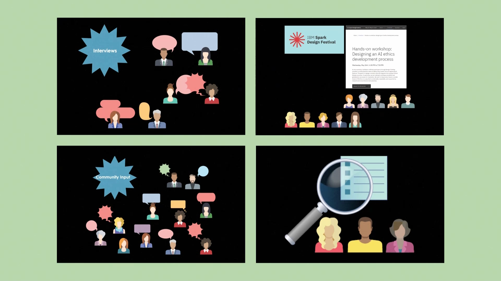

# CASCON 2021 Expo

## AI ethics: From top-down to bottom-up

Sarah Packowski ( spackows@ca.ibm.com ) 
Heather Hagerty ( hhagerty@us.ibm.com ) 
Richard Walls ( Richard.Walls@ibm.com ) 
Sara Elsharawy ( saraelsh@ibm.com )

### Expo video
Watch: [CASCON-AI-Ethics-Expo](https://raw.githubusercontent.com/spackows/CASCON-2021_AI_ethics/main/CASCON-AI-Ethics-Expo.mp4)

Images used in the video:
- https://commons.wikimedia.org/wiki/File:Litter-Lasts-This-Long.jpg
- https://commons.wikimedia.org/wiki/File:NATOPS_Pocket_Checklist_cover.jpg
- https://commons.wikimedia.org/wiki/File:Pre_Trip_Checklist_(5161314421).jpg
- https://commons.wikimedia.org/wiki/File:Street_Cleaning_Department_-_garbage_can_(40141777305).jpg
- https://commons.wikimedia.org/wiki/File:Suggestion_box.jpg

&nbsp;

### Samples
<table>
<tr>
<th>Sample link</th>
<th>Description</th>
</tr>
<tr>
<td valign="top">

<a href="https://github.com/spackows/CASCON-2021_AI_ethics/blob/main/MURAL_Warm-up.pdf"><b>Warm up activity</b></a>

</td>
<td valign="top">

A warm-up activity using <a href="https://www.mural.co">MURAL</a>.

Instructions: Participants read each of the four prompts and then paste sticky notes with their own reflections on the prompts.

<table>
<tr><th>Prompt</th><th>Goal</th></tr>
<tr>
<td>Briefly describe a time (at work or outside work) when a bad outcome was avoided because of good luck or help from others.</td>
<td>Remind participants that bad things can happen despite your best efforts, and that sometimes things go your way.  In other words, we don't necessarily deserve either the bad thing that happen to us or the windfalls.</td>
</tr>
</table>
</td>
</tr>
<tr>
<td>
</td>
<td>
</td>
</tr>
</table>

