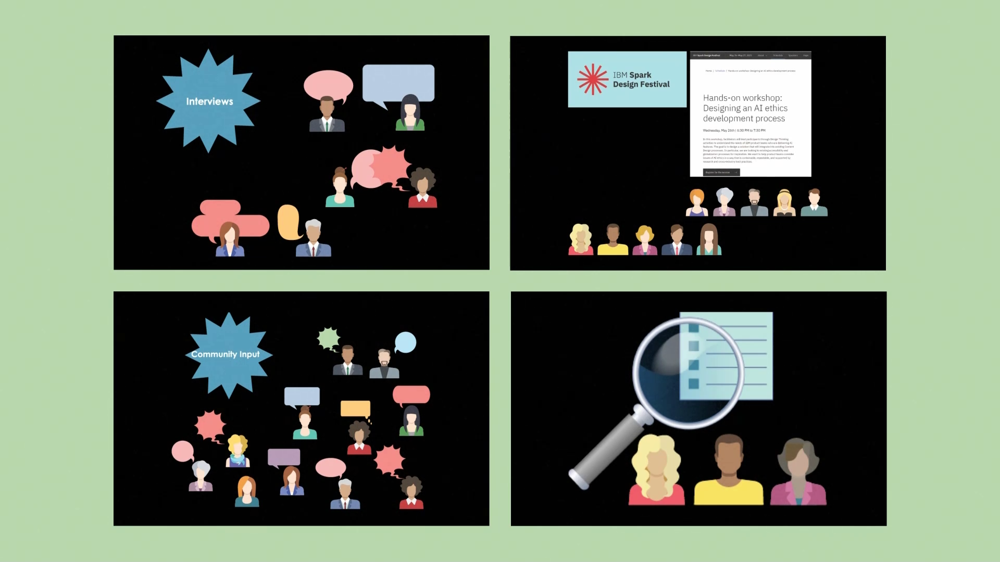
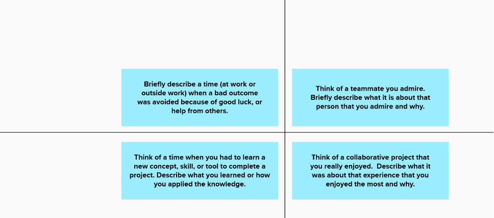
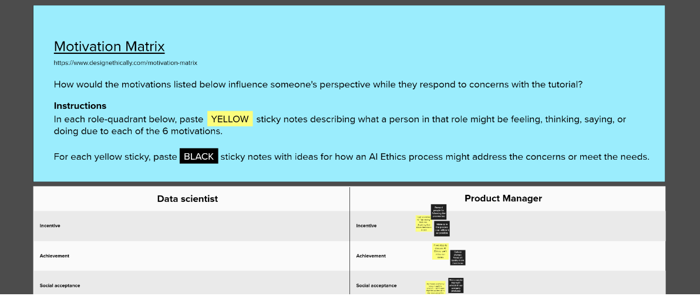
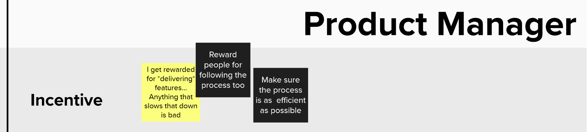
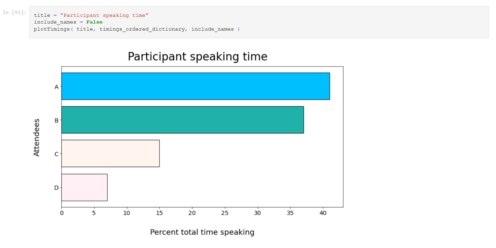

# AI ethics: From top-down to bottom-up

Sarah Packowski ( spackows@ca.ibm.com ) 
Heather Hagerty ( hhagerty@us.ibm.com ) 
Richard Walls ( Richard.Walls@ibm.com ) 
Sara Elsharawy ( saraelsh@ibm.com )

This repo contains samples and supporting information for an expo at **CASCON x EVOKE 2021**.

**Links:** 
- [Expo session](https://pheedloop.com/casconevoke2021/site/sessions/?id=SESSL97RWPH19COEC)
- [CASCON x EVOKE 2021](https://pheedloop.com/casconevoke2021/site/home)
- [IBM Canada Advanced Studies](https://www-01.ibm.com/ibm/cas/canada)

&nbsp;

## [Video]

**Watch:** [CASCON-AI-Ethics-Expo](https://raw.githubusercontent.com/spackows/CASCON-2021_AI_ethics/main/CASCON-AI-Ethics-Expo.mp4)

Images used in the video:
- https://commons.wikimedia.org/wiki/File:Litter-Lasts-This-Long.jpg
- https://commons.wikimedia.org/wiki/File:NATOPS_Pocket_Checklist_cover.jpg
- https://commons.wikimedia.org/wiki/File:Pre_Trip_Checklist_(5161314421).jpg
- https://commons.wikimedia.org/wiki/File:Street_Cleaning_Department_-_garbage_can_(40141777305).jpg
- https://commons.wikimedia.org/wiki/File:Suggestion_box.jpg

&nbsp;

## [Samples]

- [Sample 1: Warm up activity](#sample-1-warm-up-activity)
- [Sample 2: Empathy exercise](#sample-2-empathy-exercise)
- [Sample 3: Interview email](#sample-3-interview-email)
- [Sample 4: Meeting analysis](#sample-4-meeting-analysis)

&nbsp;

### Sample 1: Warm up activity
A warm-up activity using <a href="https://www.mural.co">MURAL</a>, a digital collaboration tool.

**Link:** [MURAL_Warm-up.pdf](samples/MURAL_Warm-up.pdf)

**Instructions:** Participants read each of the four prompts and then paste sticky notes with their own reflections on the prompts.

<table>
<tr><th>Prompt</th><th>Goal</th><th>Theme</th></tr>
<tr>
<td>Briefly describe a time (at work or outside work) when a bad outcome was avoided because of good luck or help from others.</td>
<td>Remind participants that bad things can happen despite your best efforts and other times things go your way.</td>
<td>Myth of meritocracy</td>
</tr>
<tr>
<td>Think of a teammate you admire.  Briefly describe what it is about that person that you admire and why.</td>
<td>Remind participants what they aspire to be like, and that they still have work to do.</td>
<td>Reflecting on values</td>
</tr>
<tr>
<td>Think of a time when you had to learn a new concept, skill, or tool to complete a project. Describe what you learned or how you applied the knowledge.</td>
<td>Remind participants how it felt to struggle, learn something new, and then succeed.</td>
<td>Growth mindset</td>
</tr>
<tr>
<td>Think of a collaborative project that you really enjoyed.  Describe what it was about that experience that you enjoyed the most and why.</td>
<td>Remind participants of the value of multiple perspectives.</td>
<td>Diverse stakeholder input</td>
</tr>
</table>

&nbsp;

### Sample 2: Empathy exercise
An empathy exercise using <a href="https://www.mural.co">MURAL</a>, a digital collaboration tool.

**Link:** [MURAL_Exercise-Parts-1-and-2.pdf](samples/MURAL_Exercise-Parts-1-and-2.pdf)

**Instructions:** Participants put themselves in the shoes of team members in different roles, to empathize with those team members and to better understand why people do what they do.

- Step 1: Participants listen to a description of a real-world example about a team navigating an issue of AI ethics.[1]
- Step 2: Participants paste yellow stickies with descriptions of what a person in a given role might be thinking, feeling, saying, and doing, _as influenced by one of 6 motivators_:
    - Incentive
    - Achievement
    - Social acceptance
    - Fear
    - Power
    - Growth
- Step 3: For each yellow sticky, participants paste a black sticky with a descriptions of a way to address or take advantage of what's written on the yellow sticky.

[1] When we used this as a workshop exercise, we drew from IBM teams' experience.  For example, a time when a team was working on a new tutorial using AI models and financial technology that had ethical implications to navigate.

**Example:**

&nbsp;

### Sample 3: Interview email
A sample email template we send to people who have agreed to participate in an interview with us about AI ethics.

**Link:** [Sample interview email](samples/Sample-interview-email.md)

We want to design systems to help teams avoid ethical pitfalls.  And to make sure people will actually use them, we need to design systems and tools that fit in with how people already like to work and tools they already use.

So we set out to interview our fellow IBMers, people in many different roles, to learn their perspective:
- How do they work today?
- What processes and tools do they use?
- What are their challenges?
- What motivates them?

When people agreed to participate in an interview, we sent then an email in advance that explains the project and lists the questions we would be asking.  We wanted people to know the questions, so they could think about their answers beforehand, without the time pressure of the interview itself.

&nbsp;

### Sample 4: Meeting analysis
A Python notebook demonstrating how to measure the amount of time participants speak in a meeting.

**Link:** [CASCON-sample-meeting-voices.ipynb](samples/CASCON-sample-meeting-voices.ipynb)

In general, for a collaborative type of meeting, it is desirable to hear from all participants somewhat equally. Also, it is potentially problematic when the same small number of people dominate discussions in meetings over time.

The goal of analyzing meeting speaking time is to measure how balanced meeting discussions are, based on the amount of time participants speak in the meeting.  Meeting chairs could track this analysis over time as they experiment with changing how they manage meetings to give everybody a chance to have their voice heard.

**Instructions:** Follow these steps to use the sample notebook in IBM Watson Studio
<ol>
<li>

Register for a free IBM Cloud account: <a href="https://cloud.ibm.com/registration">https://cloud.ibm.com/registration</a>

</li>
<li>

Create a free ("Lite" plan) instance of the Watson Studio service: <a href="https://cloud.ibm.com/catalog/services/watson-studio">https://cloud.ibm.com/catalog/services/watson-studio</a>

</li>
<li>

In Watson Studio, create a project.  See: <a href="https://dataplatform.cloud.ibm.com/docs/content/wsj/getting-started/projects.html?context=cpdaas&audience=wdp">Creating a project</a>

</li>
<li>

In your project, create a notebook from the sample notebook URL:

<ol>
<li>Click "Add to project" and then select "Notebook"</li>
<li>Navigate to the "From URL" tab in the "New notebook" page</li>
<li>In the "Name" field, enter a name of your choosing</li>
<li>Accept the default runtime (don't change anything in the "Select runtime" field)</li>
<li>In the "Notebook URL" field, paste this value: 
<pre>https://raw.githubusercontent.com/spackows/CASCON-2021_AI_ethics/main/samples/CASCON-sample-meeting-voices.ipynb</pre></li>
<li>Click "Create"</li>
</ol>
</li>
<li>

In the notebook, run the Python code by clicking on cells containing code and then clicking "Run".

</li>
</ol>

&nbsp;

